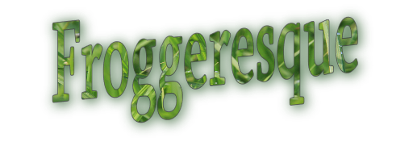

<h1>Froggeresque</h1>
<h2>Classic Arcade Game Clone project</h2>

This is my third major project for the Udacity Front End Web Developer nanodegree, based on the Frogger game.  Creating it involved taking the basic game engine provided, adding classes and methods for Player, Enemies and Gems with object-oriented Javascript and Canvas animation.

<h2>Download or Play Online</h2>

If you are reading this online, you're already inside Github, so clone it to your repository and open index.html in your browser.

Or, if you'd rather, there's a handy <strong>Download ZIP</strong> button that will let you put a local copy on your hard disk.

Or, you can play online <a href="www.constancehirsch.com/udacity/froggeresque/index.html">here</a>, on my own site!

<h2>How to Play</h2>

Just as in the classic Frogger, the aim is to get across a series of obstacles (in this case, bugs) who  are crossing your way in random speeds.

To move your player, use the arrow keys for up, down, right and left.  Don't worry, you can't fall off the screen!
 

 If your player is hit by a bug, you lose a life, and go back to the start.  When you've lost all your lives, you lose and have the option of starting the game over.

If you make it across to the far edge, you score a point.  When you have accumulated 6 points, you win.

Also to score points there are random Gems scattered across the game area.  Capture those to add points as well!  But be quick, because if a bug gets there first, the Gem gets knocked to a random location.

If you'd like a different player icon, there's a handy <strong>Change Player Icon</strong> button that will bring up several tasteful player pictures to choose from.

<h2>Attributions</h2>

<ul>
<li>"PlanetCute" art by Daniel Cook (<a href="http://www.lostgarden.com">lostgarden.com</a>)</li>
<li>Game engine.js and resources.js by Udacity</li>
</ul>

<h2>License</h2>

The project is licensed under the <a href="license.txt">MIT license</a>.
